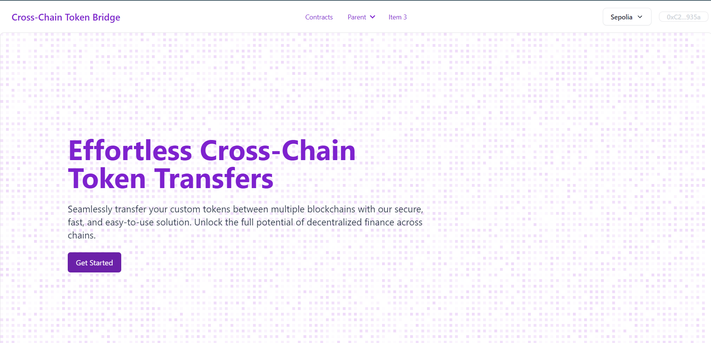
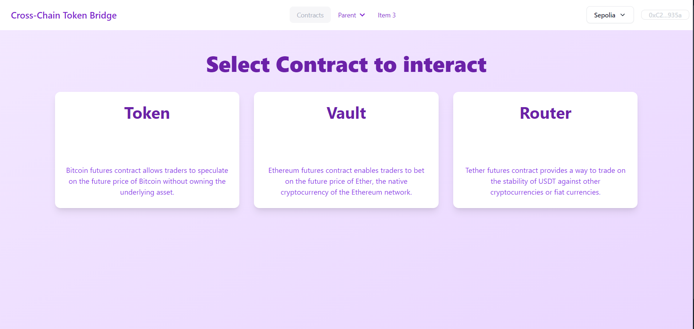
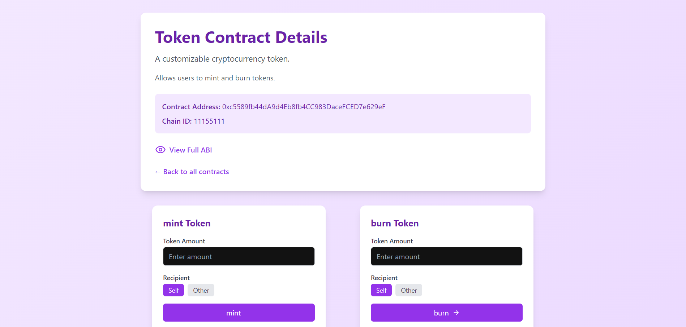

# Cross-Chain Token Bridge

## Table of Contents
- [Introduction](#introduction)
- [Features](#features)
- [Technology Stack](#technology-stack)
- [Project Structure](#project-structure)
- [Setup and Installation](#setup-and-installation)
- [Usage](#usage)
- [Smart Contracts](#smart-contracts)
- [Backend](#backend)
- [Frontend](#frontend)
- [Testing](#testing)
- [Contributing](#contributing)
- [License](#license)

## Introduction

The Cross-Chain Token Bridge is a decentralized application (dApp) that enables seamless transfer of custom tokens between multiple blockchains. This project aims to provide a secure, fast, and user-friendly solution for cross-chain token transfers, unlocking the full potential of decentralized finance across different blockchain networks.

## Features

- Effortless cross-chain token transfers
- Support for multiple blockchain networks
- User-friendly interface with responsive design
- Secure wallet connection and management
- Real-time transaction tracking and event logging
- Performance metrics and load testing capabilities

## Technology Stack

- Frontend: Next.js, React, TypeScript, Tailwind CSS, Framer Motion
- Backend: Go (Golang), MongoDB
- Blockchain Interaction: Web3.js, Ethers.js
- Smart Contracts: Solidity
- Testing: Go testing framework, Vegeta (for load testing)

## Project Structure

The project is divided into three main components:

1. Smart Contracts: Located in the `smart-contracts` directory
2. Backend: Located in the `backend` directory
3. Frontend: Located in the `frontend` directory

## Setup and Installation

(Provide step-by-step instructions for setting up the project locally)

## Usage

(Provide instructions on how to use the dApp, including any necessary configuration)

## Smart Contracts

The main smart contract for this project is `CCIP_Token.sol`, which implements the cross-chain token functionality. Key features of the contract include:

- ERC20 token implementation
- Minting and burning capabilities
- Token locking and releasing for cross-chain transfers
- Owner-only functions for contract management

## Backend

The backend, written in Go, handles:

- Event logging from smart contract interactions
- API endpoints for retrieving contract and transaction data
- MongoDB integration for data persistence
- Load testing capabilities for performance optimization

## Frontend

The frontend, built with Next.js and React, provides:

- A responsive and intuitive user interface
- Wallet connection and management
- Real-time updates of token balances and transaction status
- Contract interaction through a user-friendly interface

## Testing

The project includes various testing mechanisms:

- Smart contract tests (to be implemented)
- Backend API tests
- Load testing using the Vegeta library for performance analysis

To run the load test:
